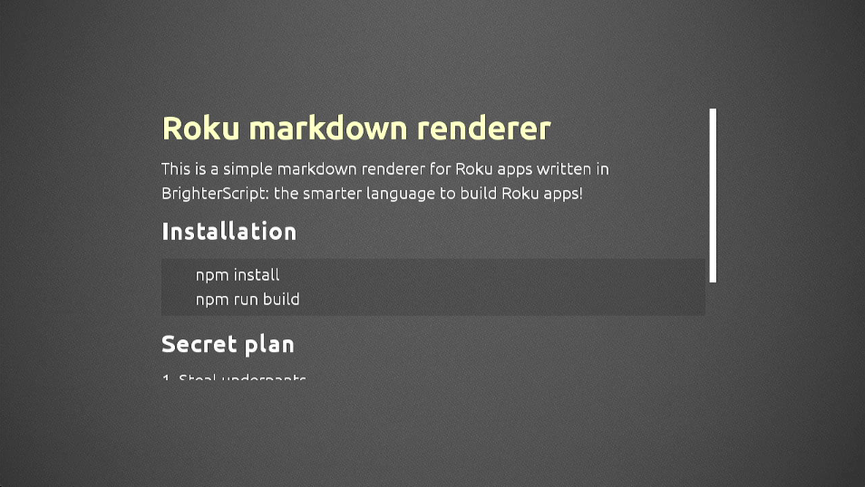

# Roku markdown renderer

This is a **simple markdown renderer** for Roku apps written in [BrighterScript](https://github.com/rokucommunity/brighterscript).



Parser and renderer support a subset of the markdown spec, and strip all inline styles.
The goal is to eventually support images between paragraphs.

There is currently no plan to support full text styling.

## Installation

### Using ropm

```bash
ropm install roku-markdown
```

Suggestion: use a shorter prefix:

```bash
ropm install md@npm:roku-markdown
```

## Usage

See `demo.bs` in the repository sources for an example of usage.

*Following example use unprefixed installation. Replace `rokumarkdown_` with `md_` if you used the prefix as suggested.*

### 1. Declare a renderer view

```xml
<rokumarkdown_Renderer id="markdownView" />
```

Optionally you can redefine some/all the fonts:
```xml
<rokumarkdown_Renderer id="markdownView">
    <Font role="font" uri="pkg:/fonts/Ubuntu_Regular.ttf" size="24" />
    <Font role="h1Font" uri="pkg:/fonts/Ubuntu_Bold.ttf" size="48" />
    <Font role="h2Font" uri="pkg:/fonts/Ubuntu_Bold.ttf" size="36" />
</rokumarkdown_Renderer>
```

Full interface:
```xml
<interface>
    <field id="width" type="int" />
    <field id="height" type="int" />
    <field id="padding" type="array" />
    <field id="itemSpacing" type="int" />
    <field id="font" type="node" />
    <field id="color" type="string" />
    <field id="align" type="string" />
    <field id="quoteFont" type="node" />
    <field id="quoteColor" type="string" />
    <field id="quoteAlign" type="string" />
    <field id="quotePadding" type="array" />
    <field id="quoteBackground" type="string" />
    <field id="codeFont" type="node" />
    <field id="codeColor" type="string" />
    <field id="codeAlign" type="string" />
    <field id="codePadding" type="array" />
    <field id="codeBackground" type="string" />
    <field id="h1Font" type="node" />
    <field id="h1Color" type="string" />
    <field id="h1Align" type="string" />
    <field id="h2Font" type="node" />
    <field id="h2Color" type="string" />
    <field id="h2Align" type="string" />
    <field id="h3Font" type="node" />
    <field id="h3Color" type="string" />
    <field id="h3Align" type="string" />
    <field id="h4Font" type="node" />
    <field id="h4Color" type="string" />
    <field id="h4Align" type="string" />
    <field id="hrColor" type="string" />
    <field id="hrSize" type="int" />
    <field id="animatedScrolling" type="boolean" alias="scroller.animatedScrolling" />
    <field id="scrollFraction" type="integer" alias="scroller.scrollFraction" />
    <field id="scrollRatio" type="integer" alias="scroller.scrollRatio" />
    <field id="overflows" type="boolean" />
    <function name="render" />
</interface>
```

**Paddings** are arrays of numbers following CSS rules:

- `[all]`
- `[top-bottom, right-left]`
- `[top, right, bottom, left]`

**Colors** and **backgrounds** are a RRGGBB or RRGGBBAA color string, e.g. `"0xFFFFFF33"`

**Alignments** are Label horizontal alignement values (`left|center|right`)

Titles after H3 are all rendered as H3.

### 2. Parse markdown source and render

**Vanilla BrightScript version**

```vbscript
parser = rokumarkdown_Parser()
data = parser.parse(markdownSrc)

view = m.top.findNode("markdownView")
view.callfunc("render", data)

' view is scrollable and can be focused
view.setFocus(true)
```

If you want an optimised non-interactive clipped render:

```vbscript
view.callfunc("render", data, false)
' view isn't scrollable anymore
```

**BrighterScript version**

```vbscript
parser = new rokumarkdown_Parser()
data = parser.parse(markdownSrc)

view = m.top.findNode("markdownView")
view@.render(data)

' view is scrollable and can be focused
view.setFocus(true)
```

If you want an optimised non-interactive clipped render:

```vbscript
view@.render(data, false)
' view isn't scrollable anymore
```

### 3. Render scrolling decorations

This component will not render a scrollbar:

- `overflows` tells whether the content is bigger than the view,
- you can observe `scrollFraction` to know the state of the scrolling,
- you can use `scrollRatio` to know how much of the content is visible VS hidden.

See the repository demo for an example rendering a scrollbar.

## Building from source

1. Install [NodeJS](https://nodejs.org)
2. install npm dependencies
    ```bash
    npm install
    ```
3. Transpile to vanilla brightscript (under `/dist`)
    ```bash
    npm run build
    ```

### Debugging

This repository comes pre-configured to work with the [BrightScript Language](https://github.com/rokucommunity/vscode-brightscript-language) extension for Visual Studio Code. So once you have that plugin installed, debugging your project is as simple as clicking the "Start Debugging" button.
